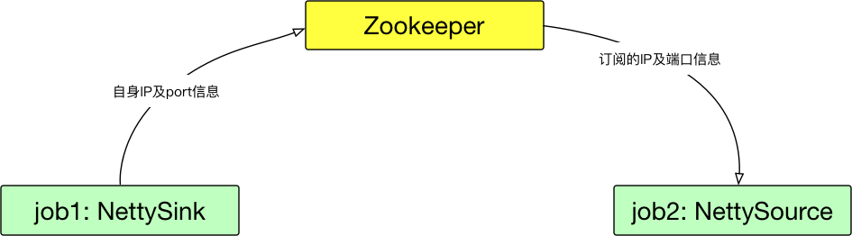
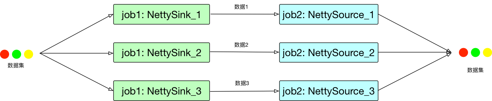
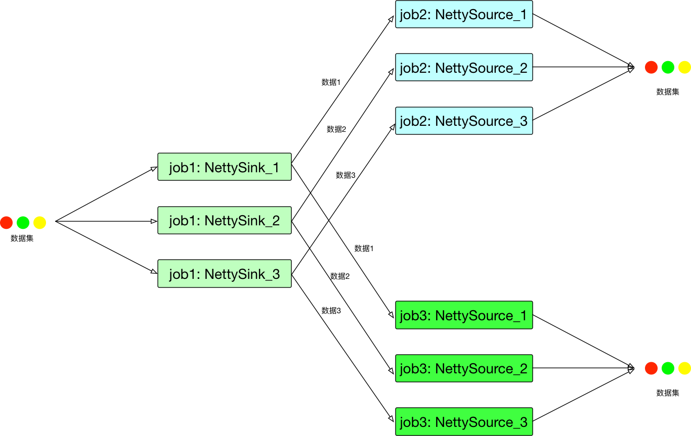
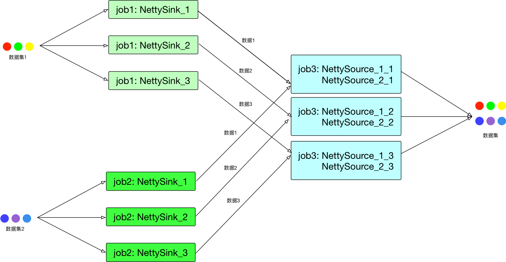

# pipeline测试

## 1. 一般功能测试
### 1.1 与Zookeeper交互
* 设计目的：
  * NettySink将自身的IP及port信息保存到Zookeeper指定的位置，NettySource算子能够从Zookeeper上读取这些信息。
* 测试设计：
  * 两个简单的Job，一个作为前端并带有NettySink算子，另个一个作为后端并带有NettySource算子，这两个算子能够分别：
    * NettySink算子能够将自身的IP及port信息写入Zookeeper
    * NettySource算子能够从Zookeeper上读取订阅NettySink的IP及Port信息 

* 预期
  * 第一个job写入成功
  * 第二个算子读取成功   

### 1.2 NettySource可以从订阅的NettySink算子中获取数据  
* 设计目的
  * Job与Job之间通过NettySink和NettySource进行通信
* 测试设计
  * 两个简单的Job，一个作为前端并带有NettySink算子的发布者，另一个作为后端并带有NettySource算子的订阅者，设置两个算子的并发度均为3，前一个job发送10条不同数据，后面job将接收到的数据输出。

* 预期
  * 后面job收到完整数据     

### 1.3 NettySink算子有多个订阅者
* 设计目的
  * 一个job的信息可能被多个后继Job共享
* 测试设计
  * 3个简单的Job，一个job作为发布者，另外两个作为订阅者，发布者发送10条不同的数据，后面两个订阅者接收者这10条数据

* 预期
  * 两个订阅者job能收到所有订阅信息

### 1.4 一个job订阅多个NettySink   
* 设计目的
  * 一个job可能有多个数据源
* 测试设计
  * 3个简单的job，2个job作为发布者，1个作为订阅者。发布者各自发送10条数据，后面的订阅者接受这些数据。

* 预期
  * 订阅者job可以收到所有订阅数据

## 2. 配置测试
### 2.1 Zookeeper相关
zookeeper认证机制使用Flink平台相关配置，另外，还定义了自己相关配置项，具体如下：
### 2.1.1 zookeeper namespace
* 设计目的
  * 保存NettySink算子的IP及port信息的根目录
  * 涉及到`nettyconnector.sinkserver.topic.storage`
* 测试设计    
  * 不配置`nettyconnector.sinkserver.topic.storage`
  * 配置`nettyconnector.sinkserver.topic.storage`
* 预期
  * 不配置在提交作业并运行时会报告错误并退出
  * 配置该项会顺利通过

### 2.2 网络相关
### 2.2.1 子网配置
* 设计目的
  * 每个物理节点可能配置多个不同的网络IP，属于不同的子网，设置该配置目的为告诉NettySink绑定哪个网络，当两个算子位于不同子网中时，无法建立连接通信。
  * 涉及到`nettconnector.sinkserver.subnet`
* 测试设计
  * 不配置`nettyconnector.sinkserver.subnet`
  * 配置`nettyconnector.sinkserver.subnet`
* 预期
  * 不配置时提交作业并运行时会报告错误并退出。
  * 配置该项通过，并绑定相关子网内的一个IP。

### 2.2.2 port范围    
* 设计目的   
  * 限定NettySink的端口在一定范围内绑定，避免端口冲突
  * 涉及到`nettyconnector.sinkserver.portrange`
* 测试设计 
  * 不配置`nettyconnector.sinkserver.portrange`
  * 配置`nettyconnector.sinkserver.portrange`
* 预期
  * 不配置提交作业并运行时会报告错误并退出
  * 配置该项通过，并绑定范围内的一个可用端口

### 2.3 加密相关
### 2.3.1 SSL加密
SSL加密使用Flink相关配置，另外，还添加了nettyconnector自己的开关。
* 设计目的
  * 保证NettySink和NettySource之间加密传输
  * 涉及到`nettyconnector.ssl.enabled`
* 测试设计
  * 打开flink加密，打开Nettyconnector加密，此时处于SSL加密状态
  * 打开flink加密，关闭nettyconnector加密，此时不会SSL加密
  * 关闭flink加密，打开nettyconnector加密，此时不会SSL加密
